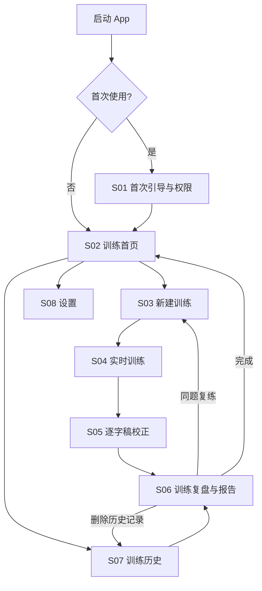

# Expression Trainer iOS App UI 信息架构与界面需求

> 文档状态：界面需求草案 v0.1  
> 更新日期：2026-07-14  
> 适用范围：iPhone 第一版低保真线框、高保真 UI 与可点击原型  
> 需求依据：[Expression Trainer iOS App PRD](./ios-app-prd.md)  
> 技术依据：[原生 iOS App 技术方案与架构设计](./ios-native-app-technical-architecture.md)

## 1. 文档目的

本文档把 PRD 中的产品需求转换为可设计的 iOS 信息架构，明确：

- 第一版需要多少个产品页面；
- 每个页面负责什么任务；
- 每个页面有哪些内容、操作和状态；
- 页面之间如何流转；
- 移动端界面的大致信息层级；
- 后续 UI 生成需要覆盖哪些关键画面。

本文档只定义信息架构、交互职责和低保真布局方向，不提前固定最终配色、字体、插画和品牌视觉。

## 2. 界面数量结论

### 2.1 产品级功能页面

P0 建议使用 **8 个产品级界面** 完成完整 App：

| ID | 页面 | 主要职责 |
|---|---|---|
| S01 | 首次引导与权限 | 解释价值、隐私边界并完成权限准备 |
| S02 | 训练首页 | 快速开始、查看最近训练、进入同题复练 |
| S03 | 新建训练 | 设置主题、训练目标、时长和 AI 偏好 |
| S04 | 实时训练 | 录音控制、实时字幕、问题标记和教练提示 |
| S05 | 逐字稿校正 | 修正识别错误、重新统计并确认报告输入 |
| S06 | 训练复盘与报告 | 展示本地数据、AI 分析、下次重点和同题复练 |
| S07 | 训练历史 | 浏览、打开和删除历史训练 |
| S08 | 设置 | 管理默认偏好、AI、隐私、权限和本地数据 |

历史记录详情复用 S06，不单独增加第九个页面。粘贴逐字稿、自定义规则、趋势分析等 P1 功能也不进入首版主导航。

### 2.2 UI 设计稿数量

“8 个页面”不等于只需要 8 张设计稿。为了指导真实开发，首轮高保真 UI 至少应覆盖 **16 张主要状态稿**：

| 页面 | 必须设计的状态 | 画面数 |
|---|---|---:|
| S01 首次引导 | 产品价值、隐私说明、权限准备 | 3 |
| S02 训练首页 | 首次空状态、回访用户状态 | 2 |
| S03 新建训练 | 默认状态 | 1 |
| S04 实时训练 | 录音中、暂停中、正在结束 | 3 |
| S05 逐字稿校正 | 有识别内容的默认状态 | 1 |
| S06 训练报告 | 本地复盘、AI 生成中、AI 报告完成 | 3 |
| S07 训练历史 | 空状态、有历史记录 | 2 |
| S08 设置 | 默认状态 | 1 |
| **合计** |  | **16** |

此外建议单独设计 **5 个自定义浮层或异常状态**：

1. 麦克风或语音识别权限被拒绝；
2. 语音识别资源准备或模型下载；
3. 退出、结束或放弃未完成训练；
4. 录音被系统中断后的恢复；
5. 删除单次训练或清除全部数据。

因此，后续用于完整 UI 生成的建议工作量是：

> 8 个功能页面，16 张主要状态稿，5 张关键浮层稿，共 21 张自定义设计画面。

iOS 系统麦克风权限框、语音识别权限框和系统分享面板直接使用系统 UI，不需要重新设计。

## 3. 导航结构

### 3.1 一级导航

建议底部只保留两个高频入口：

- **训练**：进入 S02 训练首页；
- **历史**：进入 S07 训练历史。

设置不是高频任务，从训练首页右上角进入 S08，不占用底部标签栏。

### 3.2 页面流转



### 3.3 呈现方式建议

| 页面 | iOS 呈现方式建议 | 原因 |
|---|---|---|
| S01 首次引导 | 首次启动全屏流程 | 避免底部导航干扰权限和隐私说明 |
| S02 训练首页 | Tab 根页面 + NavigationStack | 高频入口 |
| S03 新建训练 | 大尺寸 Sheet 或导航页面 | 内容不复杂，便于随时取消 |
| S04 实时训练 | Full Screen Cover | 训练时隐藏底部导航，减少误触和干扰 |
| S05 逐字稿校正 | 全屏导航页面 | 需要长文本编辑和键盘空间 |
| S06 训练报告 | 全屏导航页面 | 内容较长，需要稳定滚动和分享 |
| S07 训练历史 | Tab 根页面 + NavigationStack | 高频回看入口 |
| S08 设置 | 从首页导航进入 | 低频管理任务 |

## 4. 移动端总体设计原则

### 4.1 训练优先，而不是数据面板优先

桌面版可以同时显示左侧统计、中央字幕和右侧反馈，但 iPhone 屏幕不适合三栏并列。移动端应按以下优先级纵向组织：

1. 当前是否正在录音；
2. 当前一句和最近几句字幕；
3. 当前唯一一条教练提示；
4. 少量关键指标；
5. 暂停和结束操作。

完整统计和详细建议放到训练结束后，不能挤占实时字幕空间。

### 4.2 一次只突出一个主操作

- 首页突出“开始一次训练”；
- 新建训练页突出“开始训练”；
- 训练中突出录音状态和“暂停 / 结束”；
- 校正页突出“确认并查看复盘”；
- 报告页突出“按同一主题再练一次”。

### 4.3 实时反馈必须克制

- 屏幕上同时最多出现一条主要教练提示；
- 新提示替换旧提示，而不是不断堆叠；
- 正向反馈和改进提醒使用相同信息层级；
- 不使用大面积闪烁、持续震动或强制弹窗打断表达；
- AI 不可用时只显示轻量状态，不弹出阻断式错误。

### 4.4 问题标记不能只靠颜色

建议建立统一语义：

| 类型 | 颜色方向 | 辅助样式 | 示例标签 |
|---|---|---|---|
| 填充词 | 红色或洋红 | 波浪下划线 | 口头禅 |
| 犹豫词 | 橙色 | 实线下划线 | 不够直接 |
| 笼统词 | 黄色 | 虚线下划线 | 可以更具体 |
| 正向亮点 | 绿色 | 背景轻高亮或星标 | 这句很好 |

最终颜色需要通过深色、浅色和色觉障碍可用性测试。页面图例应使用文字和图形，不让用户仅凭颜色记忆含义。

### 4.5 本地与 AI 能力明确区分

- “本地分析”强调离线可用和客观统计；
- “AI 深度报告”强调需要联网并使用确认后的逐字稿；
- 不把 AI 服务商、模型名称等技术字段放进主流程；
- AI 失败时优先告诉用户“本地复盘已保存”，再提供重试。

## 5. 页面详细需求

### S01 首次引导与权限

#### 页面职责

- 让用户在一分钟内理解产品价值；
- 建立对录音、逐字稿和 AI 数据处理的正确预期；
- 在用户理解用途后请求系统权限。

#### 内部步骤

##### S01-A 产品价值

元素：

- 品牌标识或教练形象；
- 主标题，例如“把每一次开口，都变成有效训练”；
- 三个核心收益：实时看见问题、训练后得到改法、按同题再次练习；
- “继续”主按钮；
- “跳过介绍”次要入口，可直接进入隐私说明，不可绕过权限准备。

##### S01-B 隐私说明

元素：

- “基础训练在本机完成”说明；
- “开启 AI 后逐字稿会发送给 AI 服务”说明；
- “默认不保存原始录音”说明；
- 本地能力和云端能力对比卡片；
- 隐私政策入口；
- “我明白了”主按钮。

##### S01-C 权限准备

元素：

- 麦克风权限用途；
- 语音识别权限或模型资源用途；
- 当前授权状态；
- “允许并继续”主按钮；
- 权限被拒后的“打开系统设置”；
- “稍后设置”只允许进入只读首页，不能开始录音。

#### 大致布局

```text
┌──────────────────────────┐
│                          │
│       品牌 / 教练形象       │
│                          │
│  把每一次开口              │
│  都变成有效训练            │
│                          │
│  ✓ 实时发现表达问题         │
│  ✓ 看见原句与具体改法        │
│  ✓ 带着一个重点再练一次      │
│                          │
│      [  继续  ]           │
│        隐私说明             │
└──────────────────────────┘
```

#### 关键状态

- 权限尚未请求；
- 麦克风允许、语音识别未允许；
- 权限被拒绝；
- 语音模型或系统资源尚未准备完成。

### S02 训练首页

#### 页面职责

- 让新用户开始第一次训练；
- 让回访用户快速继续上一次训练重点；
- 提供最近训练概览、历史和设置入口。

#### 页面元素

- 导航标题或简短问候；
- 右上角设置入口；
- 大型“开始一次训练”卡片或按钮；
- 快速开始入口，使用上一次默认目标；
- 最近一次训练卡片：主题、日期、时长、主要问题、下次重点；
- “按这个主题再练一次”操作；
- 本地与 AI 状态小标签；
- 底部“训练 / 历史”标签栏。

#### 首次空状态

- 不展示没有意义的空统计；
- 用一个简单示例说明训练后会得到什么；
- 主按钮仍然是“开始第一次训练”。

#### 回访状态大致布局

```text
┌──────────────────────────┐
│ Expression Trainer    ⚙︎ │
│                          │
│  今天想练什么？            │
│ ┌──────────────────────┐ │
│ │   🎙 开始一次训练       │ │
│ │   主题和目标都可以跳过   │ │
│ └──────────────────────┘ │
│                          │
│  上次训练                  │
│ ┌──────────────────────┐ │
│ │ 为什么要做这个产品       │ │
│ │ 3分12秒 · 先说结论       │ │
│ │ 下次重点：开头先给判断    │ │
│ │ [按这个主题再练一次]      │ │
│ └──────────────────────┘ │
│                          │
│  ● 本地训练可用  AI 已开启  │
├──────────────────────────┤
│      训练          历史    │
└──────────────────────────┘
```

#### 关键交互

- 点击开始训练进入 S03；
- 点击同题复练进入已预填的 S03；
- 点击最近训练卡片进入 S06；
- 点击设置进入 S08。

### S03 新建训练

#### 页面职责

收集生成有效反馈所需的最少上下文，同时允许用户不配置直接开始。

#### 页面元素

- 页面标题“开始一次训练”；
- 主题输入框，可选；
- 训练目标单选卡片或 Chip：
  - 减少口头禅；
  - 先说结论；
  - 表达更具体；
  - 表达更直接；
  - 结构更清楚；
  - 自由练习；
- 时长选项：1、3、5、10 分钟、不限时；
- 实时 AI 反馈开关；
- AI 开启时的简短数据说明；
- 当前麦克风和语音识别状态；
- 底部固定“开始训练”按钮；
- 取消入口。

#### 大致布局

```text
┌──────────────────────────┐
│ 取消      开始一次训练      │
│                          │
│ 主题（可选）                │
│ [例如：为什么要做这个产品]   │
│                          │
│ 这次重点练什么？             │
│ [口头禅] [先说结论]          │
│ [更具体] [更直接]            │
│ [结构]   [自由练习]          │
│                          │
│ 目标时长                    │
│ [1分] [3分] [5分] [10分]    │
│                          │
│ 实时 AI 教练          开/关  │
│ 开启后会发送逐字稿用于反馈    │
│                          │
│     [  开始训练  ]          │
└──────────────────────────┘
```

#### 交互规则

- 目标只选择一个，防止实时反馈优先级冲突；
- 未输入主题时允许开始；
- 同题复练自动预填主题、目标和时长；
- 权限不可用时，主按钮改为“完成权限设置”。

### S04 实时训练

#### 页面职责

提供低干扰、可扫视的训练环境，让用户随时确认录音状态、字幕和当前唯一一条教练提示。

#### 信息层级

从上到下建议为：

1. 录音状态、计时和目标时长；
2. 本次主题与训练目标；
3. 当前教练提示；
4. 实时字幕主体；
5. 紧凑问题统计；
6. 暂停和结束控制。

#### 页面元素

- 录音状态指示和有效时长；
- 主题和目标的简短标签；
- 目标时长进度，不建议用强制倒计时；
- 单条教练提示 Banner；
- 可滚动实时字幕；
- 临时字幕和最终字幕的视觉差异；
- 填充词、犹豫词、笼统词标记；
- 三个紧凑指标：填充词、犹豫词、当前时长；
- 暂停 / 继续按钮；
- 结束按钮；
- AI 离线或关闭的小状态，不使用阻断弹窗。

#### 录音中大致布局

```text
┌──────────────────────────┐
│ ● 录音中          02:18  │
│ 为什么要做这个产品 · 结论优先│
│                          │
│ ┌──────────────────────┐ │
│ │      先说结论          │ │
│ └──────────────────────┘ │
│                          │
│      ……上一句较淡……       │
│                          │
│  我觉得这个产品就是能让     │
│  人更快发现自己表达里的问题  │
│  然后知道下一次怎么练        │
│                          │
│  口头禅 3  犹豫词 1  02:18  │
│                          │
│     [暂停]      [结束]      │
└──────────────────────────┘
```

#### 暂停状态

- 页面整体降低动态感；
- 状态改为“已暂停”；
- 教练提示停止更新；
- 主操作改为“继续训练”；
- 结束操作仍可用。

#### 正在结束状态

- 禁用重复点击；
- 显示“正在整理最后一句”；
- 保留字幕内容，不跳回首页；
- 完成后自动进入 S05。

#### 关键限制

- 不显示桌面版那样的完整左右统计面板；
- 不堆叠多条实时建议；
- 不弹出报告或长文本遮挡字幕；
- 不在训练中要求用户编辑字幕；
- 不播放教练语音。

### S05 逐字稿校正

#### 页面职责

让用户确认报告使用的文本，修正明显识别错误，并理解本地统计已经完成。

#### 页面元素

- 标题“确认逐字稿”；
- 本次主题、时长和训练目标；
- 本地摘要卡片：有效字数、语速、填充词、犹豫词；
- 可编辑完整逐字稿；
- 问题词标记与图例；
- “重新分析中”轻量状态；
- “保存记录”次要操作；
- “确认并查看复盘”主操作；
- 返回训练首页前的保存确认。

#### 大致布局

```text
┌──────────────────────────┐
│ 〈       确认逐字稿         │
│                          │
│ 3:12   486字   152字/分    │
│ 口头禅 8   犹豫词 3         │
│                          │
│ 修正明显识别错误，报告会使用  │
│ 你确认后的文字。             │
│ ┌──────────────────────┐ │
│ │ 我觉得这个产品……       │ │
│ │ 然后……                 │ │
│ │                        │ │
│ │ 可编辑完整逐字稿         │ │
│ └──────────────────────┘ │
│ ～～口头禅  __犹豫  --笼统  │
│                          │
│ [保存记录] [确认并查看复盘]  │
└──────────────────────────┘
```

#### 交互规则

- 编辑停止后重新执行本地分析；
- 重新分析不阻塞继续编辑；
- 用户确认后保存逐字稿版本；
- AI 报告只使用确认版本；
- 不在此页展示长篇 AI 报告。

### S06 训练复盘与报告

#### 页面职责

把一次训练转化为明确的学习结果，并引导用户进行同题复练。

#### 报告信息顺序

建议不要照搬桌面版长篇 Markdown 顺序。移动端从最能行动的内容开始：

1. 本次一句话总结；
2. 下次只练一个重点；
3. 客观数据；
4. 表达亮点；
5. 最重要的 2～3 个问题；
6. 原句与推荐表达；
7. 完整逐字稿；
8. 分享、删除和同题复练。

#### 本地复盘状态

元素：

- 主题、日期、时长和目标；
- “下次重点”主卡片；
- 客观数据卡片；
- 高频问题词和候选替换；
- 带标记逐字稿入口；
- “生成 AI 深度报告”卡片；
- AI 数据说明；
- “按同一主题再练一次”固定主按钮；
- 分享入口和更多菜单。

#### AI 生成中状态

- 保留全部本地复盘内容；
- 在 AI 区域显示分阶段加载或渐进式内容；
- 允许用户离开页面，后台继续或稍后重试；
- 不使用空白全屏 Loading；
- 失败时在 AI 区域内显示原因和重试，不覆盖本地结果。

#### AI 报告完成状态

- 一句话总体诊断；
- 亮点卡片，引用用户原句；
- 问题卡片，引用用户原句；
- “原句 / 推荐表达 / 为什么”对照；
- 结构、直接性、具体程度和说服力定性分析；
- 不展示未经校准的综合分数；
- AI 内容标记为“AI 分析”，客观数字标记为“本地统计”。

#### 大致布局

```text
┌──────────────────────────┐
│ 〈 训练复盘           分享  │
│ 为什么要做这个产品 · 3:12   │
│                          │
│ ┌──────────────────────┐ │
│ │ 下次只练这一件事         │ │
│ │ 开头第一句先给出判断      │ │
│ │ 练法：结论→两个理由       │ │
│ └──────────────────────┘ │
│                          │
│  本地统计                  │
│ [486字] [152字/分] [8口头禅]│
│                          │
│  ✓ 说得好的地方             │
│  “让每次开口都能被复盘……”   │
│                          │
│  最值得修改的 3 处           │
│  原句 → 推荐表达             │
│                          │
│  [生成 AI 深度报告]          │
│                          │
│  [ 按同一主题再练一次 ]       │
└──────────────────────────┘
```

#### 关键交互

- 点击原句可定位到逐字稿位置；
- 点击候选替换词可以复制；
- 点击同题复练进入预填的 S03；
- 历史进入该页面时使用相同布局；
- 分享时可选择是否包含完整逐字稿。

### S07 训练历史

#### 页面职责

让用户快速找到过去的训练、回看报告并再次练习。

#### 页面元素

- 导航标题“训练历史”；
- 按日期分组的训练列表；
- 每条记录显示：
  - 主题或“自由练习”；
  - 日期和时长；
  - 本次训练目标；
  - 1～2 个关键指标；
  - 是否已有 AI 报告；
- 点击进入 S06；
- 左滑删除；
- 空状态引导开始第一次训练；
- 底部“训练 / 历史”标签栏。

#### 首版不包含

- 搜索；
- 多维筛选；
- 周/月趋势图；
- 批量编辑；
- 云同步状态。

这些功能在记录数量和用户需求得到验证后进入 P1。

#### 有记录状态大致布局

```text
┌──────────────────────────┐
│ 训练历史                  │
│                          │
│ 今天                      │
│ ┌──────────────────────┐ │
│ │ 为什么要做这个产品       │ │
│ │ 3:12 · 结论优先         │ │
│ │ 口头禅 8 · AI 报告已完成 │ │
│ └──────────────────────┘ │
│                          │
│ 7月13日                   │
│ ┌──────────────────────┐ │
│ │ 自由练习                │ │
│ │ 1:48 · 表达更具体       │ │
│ │ 口头禅 3 · 本地复盘      │ │
│ └──────────────────────┘ │
├──────────────────────────┤
│      训练          历史    │
└──────────────────────────┘
```

### S08 设置

#### 页面职责

集中管理低频偏好、AI 隐私、权限和本地数据，不让技术设置侵入训练流程。

#### 页面分组

##### 训练偏好

- 默认训练目标；
- 默认训练时长；
- 默认是否显示实时教练提示。

##### AI 与隐私

- 实时 AI 反馈总开关；
- AI 深度报告说明；
- AI 数据使用说明；
- 隐私政策；
- 如果产品最终采用用户自备 API Key，再增加独立安全配置页，不直接把多家模型选择暴露在 P0 主设置中。

##### 权限与语音识别

- 麦克风权限状态；
- 语音识别权限状态；
- 语音资源状态；
- 打开系统设置；
- 当前语言说明，不向普通用户展示底层引擎名称。

##### 数据管理

- 本地记录数量和占用空间；
- 清除全部训练数据；
- 原始录音默认不保存的说明。

##### 关于

- App 版本；
- 帮助与反馈；
- 服务条款和隐私政策。

#### 大致布局

使用原生分组列表。危险操作放在页面底部并使用明确确认，不把“清除全部数据”与普通开关放在一起。

## 6. 关键浮层与异常状态

### O01 权限被拒绝

- 标题直接说明缺少什么权限；
- 一句话解释为什么需要；
- 主按钮“打开系统设置”；
- 次要按钮“暂时不训练”；
- 不反复触发系统权限框。

### O02 语音资源准备

- 显示“正在准备离线语音识别”；
- 如需下载，显示大小、网络类型和进度；
- 允许取消并稍后继续；
- 空间不足时给出明确解决方法；
- 不暴露 Sherpa、ONNX、AssetInventory 等底层名词。

该浮层是否需要下载进度，取决于最终 ASR 技术路线。

### O03 退出或放弃训练

- 录音尚未产生有效字幕：提供“放弃训练 / 继续训练”；
- 已产生有效字幕：提供“保存当前内容 / 放弃 / 继续训练”；
- “继续训练”为安全默认操作；
- 放弃使用破坏性按钮样式。

### O04 录音被系统中断

- 显示中断原因的用户可理解描述，例如“电话占用了麦克风”；
- 保留已确认字幕和计时；
- 条件允许时显示“继续训练”；
- 无法恢复时显示“结束并保存”。

### O05 删除确认

- 删除单次训练时显示主题和日期；
- 清除全部数据时显示记录数量；
- 明确说明删除不可撤销；
- 如未来存在云同步，需要单独说明删除范围。

## 7. 通用组件清单

为保证 8 个页面的一致性，建议建立以下可复用组件：

| 组件 | 使用页面 | 作用 |
|---|---|---|
| PrimaryActionButton | S01、S03、S05、S06 | 每页唯一主要操作 |
| TrainingGoalChip | S03、S06 | 选择或展示训练目标 |
| SessionSummaryCard | S02、S07 | 展示单次训练摘要 |
| MetricCard | S05、S06、S07 | 展示客观统计 |
| RecordingStatusView | S04 | 展示录音、暂停、结束状态 |
| CoachPromptBanner | S04 | 展示唯一实时提示 |
| TranscriptLine | S04、S05、S06 | 展示临时、最终和可编辑文本 |
| ExpressionIssueMark | S04、S05、S06 | 标记填充、犹豫、笼统和亮点 |
| IssueLegend | S04、S05、S06 | 解释标记含义 |
| EvidenceQuoteCard | S06 | 展示问题或亮点的原句证据 |
| RewriteComparisonCard | S06 | 展示原句、建议和原因 |
| LocalAIBadge | S02、S03、S06、S08 | 区分本地能力和 AI 能力 |
| EmptyStateView | S02、S07 | 首次使用和无历史状态 |
| InlineServiceState | S04、S06 | 展示 AI 关闭、无网、生成失败和重试 |

## 8. 页面状态矩阵

| 页面 | 加载/准备 | 空状态 | 正常状态 | 错误/降级 | 破坏性操作 |
|---|---|---|---|---|---|
| S01 首次引导 | 权限查询中 | 不适用 | 权限可用 | 权限拒绝、资源未准备 | 不适用 |
| S02 首页 | 最近记录加载中 | 首次无记录 | 有最近训练 | 历史加载失败 | 不适用 |
| S03 新建训练 | 权限检查中 | 主题可为空 | 配置完成 | 权限不可用、AI 不可用 | 取消配置 |
| S04 实时训练 | 识别准备中 | 尚未说话 | 录音、暂停、结束 | 中断、AI 离线、识别失败 | 放弃训练 |
| S05 逐字稿校正 | 重新分析中 | 无有效文本 | 可编辑文本 | 保存失败 | 放弃记录 |
| S06 报告 | AI 生成中 | 仅本地数据 | AI 完整报告 | AI 超时、无网 | 删除记录 |
| S07 历史 | 加载中 | 无历史 | 分组列表 | 读取失败 | 删除记录 |
| S08 设置 | 状态查询中 | 不适用 | 分组设置 | Key/服务/权限异常 | 清除全部数据 |

## 9. 文案与内容原则

- 使用“训练”“逐字稿”“本地复盘”“AI 深度报告”等用户能理解的词；
- 不在主流程中出现 ASR、LLM、endpoint、token、ONNX 等技术术语；
- 反馈描述具体行为，不给用户贴人格标签；
- 负向提醒针对这一段表达，不使用“你表达能力很差”等评价；
- 错误文案先说明已保住什么，再说明下一步，例如“本地复盘已保存，AI 报告暂时生成失败”；
- 同一概念只使用一个名称，例如统一使用“填充词”或“口头禅”，正式 UI 前需要最终选定；
- 实时提示使用短句，报告允许更完整解释。

## 10. UI 生成前需要准备的内容

### 10.1 必须先确认

- 品牌正式名称：Expression Trainer、中文名或双品牌；
- 公开产品还是个人工具；
- 是否沿用桌面版黑色 + 洋红的视觉资产；
- 是否保留“宇宙无敌少女”教练人格与文案风格；
- 浅色模式和深色模式的首发优先级；
- 实时 AI 默认开启还是默认关闭；
- 首版是否出现 API Key 配置；
- 最低支持 iOS 版本和语音资源准备方式。

### 10.2 UI 生成输入材料

- App 名称、Logo 和 App Icon 方向；
- 教练角色是否需要插画或头像；
- 品牌主色和语义色；
- 2～3 段真实训练逐字稿；
- 一份真实本地复盘数据；
- 一份经过确认的 AI 报告示例；
- 空状态、网络失败、权限拒绝等短文案；
- 目标 iPhone 画板尺寸和深浅色要求。

## 11. 低保真与高保真设计顺序

建议按风险而不是按页面编号进行设计：

1. S04 实时训练：验证手机上字幕、提示、统计和控制能否共存；
2. S06 训练报告：验证长内容的信息层级和“再练一次”闭环；
3. S05 逐字稿校正：验证长文本编辑和问题标记；
4. S03 新建训练：验证开始训练前的信息量是否足够克制；
5. S02 首页和 S07 历史：建立日常导航和回访体验；
6. S01 首次引导和 S08 设置：补齐权限、隐私和管理流程；
7. 5 个关键浮层与异常状态；
8. 最后统一视觉语言、动效、深浅色和可访问性。

## 12. UI 阶段验收标准

在进入代码设计前，UI 原型至少应证明：

- 新用户能在不解释的情况下找到并开始第一次训练；
- 用户能区分本地能力与需要联网的 AI 能力；
- 训练中不阅读说明也能判断当前是录音、暂停还是结束状态；
- 实时提示、字幕和控制在小屏 iPhone 上不会相互遮挡；
- 用户能够修正逐字稿并理解报告使用的是修正版本；
- 报告中的客观数据、AI 观点和用户原句证据层级清楚；
- 用户能从报告页直接进行同题复练；
- 无网、AI 失败、权限拒绝和录音中断都有完整出口；
- 所有危险操作均有确认，训练记录不会因普通返回操作意外丢失；
- 动态字体和 VoiceOver 下仍能完成核心流程。
