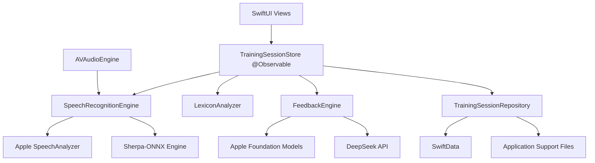

# Expression Trainer 原生 iOS App 技术方案与架构设计

> 文档状态：技术选型建议稿  
> 更新日期：2026-07-14  
> 适用范围：将现有 Electron 桌面应用迁移为原生 iPhone App

## 1. 执行摘要

现有产品可以改造成原生 iOS App，本地语音识别也可以在现代 iPhone 上运行。但当前 Electron 应用不能直接打包或安装到 iOS，需要用 Swift 重建应用壳、录音链路、语音识别桥接和本地存储。

推荐的总体方案是：

- 使用 **Swift 6 + SwiftUI** 构建纯原生界面。
- 如果最低系统版本可以设为 iOS 26，优先使用 **Apple SpeechAnalyzer + SpeechTranscriber** 完成本地实时语音识别。
- 将语音识别定义为可替换的 `SpeechRecognitionEngine`，为 **Sherpa-ONNX** 保留备用实现。
- 使用 **AVAudioSession + AVAudioEngine** 采集麦克风音频。
- 将现有词库分析逻辑迁移为纯 Swift `LexiconAnalyzer`，继续完全离线运行。
- 第一版继续通过 **DeepSeek API** 生成实时建议和最终报告；在支持 Apple Intelligence 的设备上，可选择使用 **Foundation Models** 生成本地短反馈。
- 用户自己填写的 API Key 保存到 **Keychain**；如果使用产品方统一 API Key，则必须通过后端代理，不能把密钥打包进 App。
- 使用 **SwiftData** 保存训练历史、逐字稿和报告；模型文件与大体积缓存保存到 Application Support。

## 2. 现有产品分析

### 2.1 当前技术结构

当前项目是 Electron 桌面应用：

- `main.js`：Electron 主进程、设置存储、IPC、AI 请求入口。
- `preload.js`：将 Electron IPC 能力暴露给页面。
- `src/`：HTML、CSS、JavaScript 界面和训练状态。
- `lib/asr.js`：通过 `sherpa-onnx-node` 运行流式 Paraformer。
- `lib/lexicon.js`：本地词库匹配和表达分析。
- `lib/prompts.js`：实时反馈和最终报告 Prompt。
- `lib/ai-feedback.js`：DeepSeek、OpenAI、Ollama 等后端调用。

其中 Electron、Node.js、`sherpa-onnx-node`、IPC 和桌面文件对话框不能直接迁移到 iOS。词库、规则、Prompt、统计公式和产品交互流程可以复用或翻译成 Swift。

### 2.2 当前语音模型

项目使用 `sherpa-onnx-streaming-paraformer-bilingual-zh-en` 的 INT8 权重：

| 文件 | 大小 |
|---|---:|
| `encoder.int8.onnx` | 165,462,184 bytes |
| `decoder.int8.onnx` | 71,664,561 bytes |
| `tokens.txt` | 75,756 bytes |
| 合计 | 约 226.2 MiB |

在 M4 Mac 上使用与项目相同的 CPU、2 线程配置实测：模型初始化约 0.8 秒，10.05 秒测试音频约 0.56 秒完成识别，独立识别进程常驻内存约 760 MiB。

这个模型不是数十亿参数的大语言模型，现代 iPhone 具备运行能力。移动端更需要关注的是 App 安装体积、内存峰值、持续录音耗电和热状态，而不是传统意义上的独立 GPU 显存。

## 3. iOS 技术路线比较

| 路线 | 优点 | 主要代价 | 建议 |
|---|---|---|---|
| SwiftUI 原生 | 最佳系统集成、性能、功耗和长期维护性 | UI 和平台层需要重写 | **推荐** |
| Flutter | Android/iOS 共用代码，Sherpa 有现成插件 | 不符合纯原生目标，界面仍需重写 | 暂不采用 |
| React Native | JavaScript 团队容易上手 | 实时音频和原生模型桥接更复杂 | 暂不采用 |
| WebView/Capacitor | 可复用部分 HTML/CSS | Sherpa 仍需自定义 Swift 桥接，长期复杂度较高 | 不推荐 |

由于当前目标明确是原生 iOS App，建议直接采用 SwiftUI，不再保留 Electron/WebView 运行时。

## 4. 语音识别方案

### 4.1 方案 A：Apple SpeechAnalyzer

如果最低系统版本可以设为 iOS 26，首选 `SpeechAnalyzer + SpeechTranscriber`。

适合本产品的原因：

- 在设备端完成识别，语音不需要上传服务器。
- 支持实时临时结果与最终结果。
- 面向长时间录音、会议、对话和远距离讲话场景。
- 模型由系统通过 `AssetInventory` 下载、保留和自动更新。
- 模型不增加 App 下载体积，并运行在 App 自身内存空间之外。
- 采用原生 Swift Actor、AsyncSequence 和音频输入接口，减少 C/C++ 桥接维护成本。

风险与限制：

- 需要 iOS 26 和满足要求的设备。
- 必须通过 `SpeechTranscriber.supportedLocale(equivalentTo:)` 在运行时确认中文 locale 是否支持。
- 中文口头语、中英混说、方言和填充词识别质量必须通过真机语料验证。
- 系统模型更新后，识别行为可能变化，需要建立回归测试集。

### 4.2 方案 B：Sherpa-ONNX

以下情况建议使用 Sherpa：

- 必须支持 iOS 17/18 等较老系统。
- Apple SpeechAnalyzer 在目标中文场景中的准确率不足。
- 需要与桌面端保持相同的识别结果和模型版本。
- 需要完全控制模型发布、回滚和词表。

Sherpa 官方提供 Swift API、iOS 构建方案以及 SwiftUI 实时录音示例。官方示例使用 `AVAudioEngine` 获取音频、使用 `AVAudioConverter` 转换为 16 kHz Float32 单声道，并通过 `sherpa-onnx.xcframework` 与 `onnxruntime.xcframework` 调用识别器。

需要承担的成本：

- 约 226 MiB 模型下载或安装体积。
- ONNX Runtime 与 Sherpa XCFramework 集成和升级。
- 模型下载、断点续传、SHA-256 校验、版本回滚和磁盘清理。
- 更高的 App 内存与持续推理功耗。

### 4.3 最终建议

架构上定义统一协议，但按阶段交付：

1. 先用真实中文录音对 Apple SpeechAnalyzer 和当前 Paraformer 做 A/B 测试。
2. 如果 iOS 26 的中文质量满足要求，第一版只发布 Apple 引擎，不携带 Sherpa 权重。
3. 如果质量不足或需要兼容旧系统，再实现 Sherpa 引擎，不修改上层业务和 UI。

建议的协议边界：

```swift
protocol SpeechRecognitionEngine: Sendable {
    var events: AsyncStream<SpeechRecognitionEvent> { get }

    func prepare() async throws
    func start() async throws
    func stop() async
}

enum SpeechRecognitionEvent: Sendable {
    case partial(String)
    case final(String)
    case failed(String)
}
```

## 5. 推荐技术栈

| 领域 | 推荐技术 |
|---|---|
| 语言 | Swift 6，开启严格并发检查 |
| UI | SwiftUI |
| 状态管理 | Observation、`@Observable`、`@MainActor` |
| 音频 | AVAudioSession、AVAudioEngine、AVAudioConverter |
| 首选 ASR | SpeechAnalyzer、SpeechTranscriber、AssetInventory |
| 备用 ASR | Sherpa-ONNX Swift API + XCFramework |
| 网络 | URLSession、Codable、async/await |
| API Key | Keychain Services |
| 偏好设置 | AppStorage / UserDefaults |
| 训练历史 | SwiftData |
| 大文件 | Application Support + FileManager |
| 分享导出 | ShareLink / UIActivityViewController / fileExporter |
| 日志 | OSLog |
| 性能分析 | Instruments、MetricKit |
| 依赖管理 | Swift Package Manager；Sherpa 二进制封装为本地 binary target |
| 测试 | Swift Testing、XCTest、XCUITest |

不建议第一版引入较重的 TCA。当前产品复杂度使用 Feature 分层、协议隔离和 `@Observable` 状态对象即可；等协作人数和功能规模明显扩大后再评估更重的状态框架。

## 6. 总体架构



### 6.1 分层职责

#### Presentation

- SwiftUI 页面、导航、字幕动画、统计面板和报告展示。
- 只依赖业务状态和协议，不直接操作 ONNX、Keychain 或 URLSession。

#### Domain

- `TrainingSession`
- `TranscriptSegment`
- `FeedbackItem`
- `TrainingReport`
- `LexiconAnalyzer`
- Prompt 组装和统计公式

这一层不依赖 Apple UI 框架，可以进行快速单元测试。

#### Services

- `AudioCaptureService`
- `AppleSpeechRecognitionEngine`
- `SherpaSpeechRecognitionEngine`
- `DeepSeekFeedbackEngine`
- `AppleFoundationFeedbackEngine`
- `ModelManager`
- `APIKeyStore`

#### Persistence

- SwiftData：训练会话、逐字稿、指标、AI 报告和用户自定义规则。
- UserDefaults：非敏感的轻量设置。
- Keychain：DeepSeek/OpenAI API Key。
- Application Support：Sherpa 模型和可重新下载的大文件。

## 7. 音频与实时识别设计

推荐数据链路：

```text
麦克风
  → AVAudioSession
  → AVAudioEngine input tap
  → 音频格式转换
  → SpeechRecognitionEngine
  → partial / final 识别事件
  → TrainingSessionStore
  → SwiftUI 字幕与词库分析
```

关键约束：

- 麦克风回调属于实时音频路径，不能在回调中执行网络请求、写数据库或进行复杂 UI 更新。
- 如果使用 Sherpa，不应直接在音频回调中长时间执行 `decode()`；应复制必要的 Float32 样本并投递到专用串行队列。
- 识别结果再切换到 `MainActor` 更新界面。
- 必须处理来电、耳机插拔、蓝牙切换、App 进入后台、录音权限被拒绝和 AudioSession 中断。
- 录音结束时要显式完成输入并获取最后一段 final transcript，避免丢失尾句。

## 8. 本地词库与表达分析

现有 `data/emotion-lexicon.json` 和 `data/tiered-lexicon.json` 可以直接作为 App Bundle 资源。

迁移建议：

- 使用 `Codable` 将 JSON 解码为 Swift 结构体。
- 将填充词、犹豫词、笼统词映射和最大正向匹配算法迁移为纯 Swift。
- 每收到一个 final 句子进行一次完整分析；partial 结果只做轻量高亮，避免重复计数。
- 统计模型保持可测试，输入一段文本即可得到确定结果。
- 用户自定义口癖词单独保存，不修改 App Bundle 内置词库。

## 9. AI 反馈设计

### 9.1 DeepSeek

第一版建议保留 DeepSeek 作为完整报告和高质量实时建议引擎：

- 通过 `URLSession` 和 async/await 调用 OpenAI 兼容接口。
- 使用 Actor 管理请求状态，取消已经过期的实时反馈请求。
- 对实时反馈做字符阈值、节流和去重，避免每次字幕变化都请求 API。
- 最终报告支持流式显示，降低等待感。
- 网络错误不应影响本地录音、字幕和词库分析。

密钥策略：

- 个人工具：用户输入自己的 API Key，保存到 Keychain。
- 公开产品：App 调用自有后端，由后端保管供应商密钥并处理鉴权、额度、计费和滥用控制。
- 禁止将产品方 DeepSeek Key 写入源码、Info.plist 或远程配置明文中。

### 9.2 Apple Foundation Models

在支持 Apple Intelligence 的设备上，可以使用 Foundation Models 完成：

- 8 字以内的实时教练提示。
- 文本分类和结构化评分。
- 关键句提取、摘要和短报告。

它适合离线、隐私优先和低延迟场景，但并非所有设备和用户配置都可用。完整长报告、复杂推理和跨设备一致性仍建议保留 DeepSeek 作为主要或回退引擎。

建议同样定义统一协议：

```swift
protocol FeedbackEngine: Sendable {
    func realtimeFeedback(for transcript: String) async throws -> FeedbackItem?
    func finalReport(for session: TrainingSession) async throws -> TrainingReport
}
```

## 10. 数据模型与本地存储

建议的核心实体：

- `TrainingSession`
  - id、开始时间、结束时间、主题、状态
  - 总字数、时长、填充词、犹豫词、笼统词、表达密度
- `TranscriptSegment`
  - text、开始时间、结束时间、是否最终结果
- `FeedbackItem`
  - type、message、创建时间、关联文本片段
- `TrainingReport`
  - Markdown 内容、模型提供方、模型名称、生成时间
- `TrainingPreferences`
  - 用户目标、自定义规则、偏好风格、自定义口癖词

SwiftData 保存结构化记录；Markdown 报告可以同时保存在数据库和可导出的文件中。Sherpa 模型属于可重新下载资源，应放入 Application Support 并排除 iCloud 备份。

## 11. Sherpa 模型下载与版本管理

仅在采用 Sherpa 引擎时需要实现：

1. App 内置模型清单：版本、下载 URL、大小、SHA-256、语言和最低 App 版本。
2. 首次启动或用户启用 Sherpa 时再下载模型，不把 226 MiB 权重直接打入 IPA。
3. 使用后台 URLSession 支持续传和进度展示。
4. 先保存为临时 `.part` 文件，下载完成并校验后原子移动到正式位置。
5. 校验可用磁盘空间，支持删除和重新下载。
6. 新模型验证成功后再切换，保留一个可回滚版本。
7. 默认仅在 Wi-Fi 下下载，并允许用户主动选择蜂窝网络。

## 12. 目录结构建议

```text
ExpressionTrainerIOS/
├── App/
│   ├── ExpressionTrainerApp.swift
│   └── AppEnvironment.swift
├── Features/
│   ├── Training/
│   ├── Reports/
│   ├── History/
│   └── Settings/
├── Domain/
│   ├── Models/
│   ├── Lexicon/
│   └── Prompts/
├── Services/
│   ├── Audio/
│   ├── Speech/
│   ├── Feedback/
│   ├── ModelManagement/
│   └── Security/
├── Persistence/
│   ├── SwiftData/
│   └── Files/
├── Resources/
│   ├── Lexicons/
│   └── Localizable.xcstrings
└── Tests/
    ├── DomainTests/
    ├── SpeechTests/
    └── UITests/
```

## 13. 现有代码迁移映射

| 现有模块 | iOS 对应实现 | 复用程度 |
|---|---|---|
| `src/index.html`、`styles.css` | SwiftUI TrainingView | 复用视觉与交互概念，代码重写 |
| `src/app.js` | TrainingSessionStore + Feature Views | 迁移状态机和业务流程 |
| `lib/asr.js` | SpeechRecognitionEngine | 迁移参数；运行时替换 |
| `lib/lexicon.js` | LexiconAnalyzer | 算法可直接翻译 |
| `lib/prompts.js` | PromptBuilder | Prompt 内容可直接复用 |
| `lib/ai-feedback.js` | DeepSeekClient | 请求语义复用，代码重写 |
| `data/*.json` | Bundle JSON Resources | 基本可直接复用 |
| `main.js`、`preload.js` | 原生 Service/Repository | Electron IPC 不复用 |
| `settings.json` | AppStorage + Keychain | 数据字段可迁移 |

## 14. 测试与性能要求

### 14.1 识别评测集

在确定 ASR 引擎前，建立至少覆盖以下场景的真机录音集：

- 普通话安静环境。
- 办公室、户外、咖啡店等噪声环境。
- 快速表达、低声表达、远距离表达。
- 中英混说、数字、人名和产品名。
- 常见填充词、犹豫词和连续长句。
- 目标用户常见方言或口音。

比较指标：字错误率、首个 partial 延迟、final 延迟、填充词召回率、10 分钟连续录音耗电、内存峰值和设备热状态。

### 14.2 自动化测试

- LexiconAnalyzer：纯单元测试，覆盖词语重叠、重复计数和空文本。
- PromptBuilder：快照测试，防止 Prompt 意外变化。
- SessionStore：录音状态转换和统计累积测试。
- DeepSeekClient：使用 URLProtocol Mock 测试成功、限流、超时和错误响应。
- ModelManager：下载中断、校验失败、空间不足和回滚测试。
- UI：权限拒绝、首次启动、录音开始/结束、报告生成和分享流程。

## 15. 分阶段实施建议

### 阶段 0：技术验证

- 创建最小 SwiftUI 真机项目。
- 接入 Apple SpeechAnalyzer。
- 接入 Sherpa 官方 SwiftUI 示例和当前 Paraformer。
- 使用同一批中文录音做准确率、延迟、内存和耗电对比。
- 决定最低 iOS 版本和第一版 ASR 引擎。

### 阶段 1：原生基础框架

- 建立 Feature 目录、领域模型和协议。
- 完成录音权限、AudioSession、中断处理和实时字幕。
- 完成 SwiftData 会话保存。

### 阶段 2：核心训练能力

- 迁移词库和表达分析。
- 实现字幕高亮、统计面板和训练反馈 UI。
- 完成历史记录、报告查看和 Markdown 分享。

### 阶段 3：AI 能力

- 接入 DeepSeek 和 Keychain。
- 实现请求取消、节流、错误恢复和最终报告流式输出。
- 在支持设备上试验 Foundation Models 本地短反馈。

### 阶段 4：发布质量

- 真机矩阵测试、Instruments 性能和功耗优化。
- 隐私说明、数据流说明和 App Store 权限文案。
- 可访问性、动态字体、深色模式和本地化。
- 崩溃、性能和模型版本监控。

## 16. 开发前需要确认的产品决策

1. 最低版本是否可以设为 iOS 26。
2. 是否只支持 iPhone，还是同时适配 iPad。
3. 第一版是否要求无网络也能生成 AI 报告。
4. DeepSeek Key 是用户自备，还是由产品统一提供服务。
5. 是否需要兼容中英混说和特定方言。
6. 训练历史是否需要 iCloud 同步。
7. 是否保存原始录音，还是只保存逐字稿和报告。

## 17. 最终技术结论

推荐以 **Swift 6 + SwiftUI + Apple SpeechAnalyzer + AVAudioEngine + SwiftData + Keychain + URLSession** 作为原生 iOS 第一版技术栈。

同时通过协议隔离语音识别和 AI 反馈：

- Apple SpeechAnalyzer 解决安装体积、模型维护和 App 内存压力。
- Sherpa-ONNX 保证中文场景质量、旧系统兼容和模型可控性。
- DeepSeek 提供高质量完整报告。
- Foundation Models 在可用设备上提供本地、隐私优先的短反馈。

在正式开发完整 App 前，最重要的工作不是先重写全部 UI，而是先用真实中文语料完成 Apple SpeechAnalyzer 与当前 Paraformer 的真机 A/B 测试。这个结果将决定最低系统版本、安装体积、模型维护成本和后续架构复杂度。

## 18. 官方参考资料

- [Apple Speech framework](https://developer.apple.com/documentation/speech/)
- [Apple SpeechAnalyzer](https://developer.apple.com/documentation/speech/speechanalyzer)
- [Apple AssetInventory](https://developer.apple.com/documentation/speech/assetinventory)
- [WWDC25: Bring advanced speech-to-text to your app with SpeechAnalyzer](https://developer.apple.com/videos/play/wwdc2025/277/)
- [Apple AVAudioEngine](https://developer.apple.com/documentation/avfaudio/avaudioengine)
- [Apple Keychain Services](https://developer.apple.com/documentation/security/keychain-services)
- [WWDC25: Meet the Foundation Models framework](https://developer.apple.com/videos/play/wwdc2025/286/)
- [Sherpa-ONNX iOS documentation](https://k2-fsa.github.io/sherpa/onnx/ios/index.html)
- [Sherpa-ONNX official SwiftUI example](https://github.com/k2-fsa/sherpa-onnx/tree/master/ios-swiftui/SherpaOnnx)
- [Sherpa-ONNX online Paraformer model documentation](https://k2-fsa.github.io/sherpa/onnx/pretrained_models/online-paraformer/paraformer-models.html)

## 19. 当前项目相关文件

- [桌面端 ASR 配置](../lib/asr.js)
- [本地词库分析](../lib/lexicon.js)
- [Prompt 模板](../lib/prompts.js)
- [AI 后端调用](../lib/ai-feedback.js)
- [当前训练界面逻辑](../src/app.js)
- [情绪词库](../data/emotion-lexicon.json)
- [分级词库](../data/tiered-lexicon.json)
